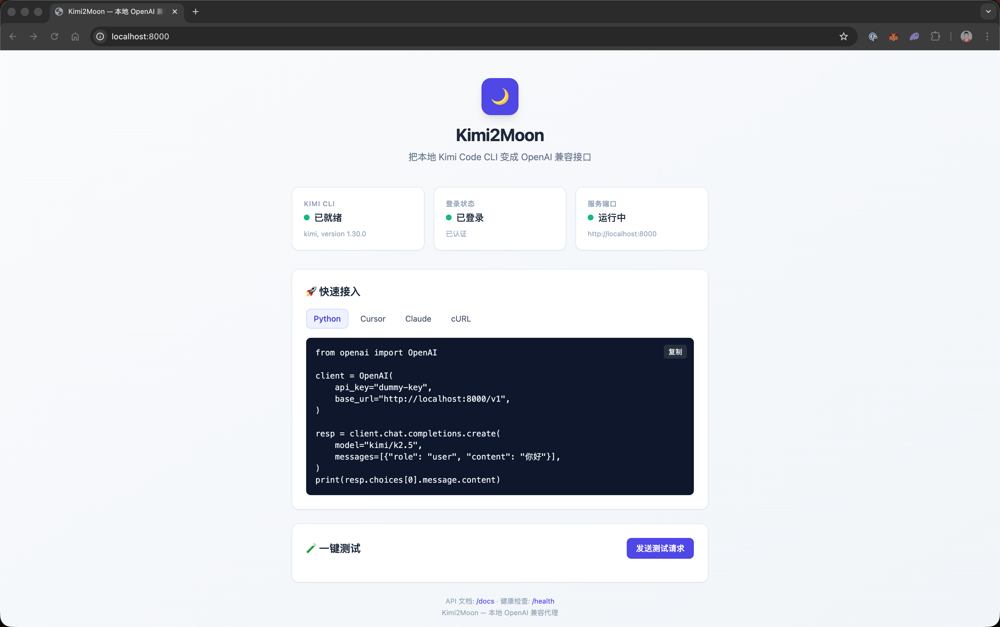

# Kimi2Moon 🌙

把本地 `kimi` CLI 包装成 **OpenAI 兼容接口**，让 Cursor、Claude、ChatGPT Next Web 等客户端直接接入 Kimi Code。



> 打开 `http://localhost:8000` 即可看到状态面板，一键测试连通性。

## ✨ 特性

- **OpenAI 兼容** — 支持 `/v1/chat/completions` 和 `/v1/models`
- **零配置启动** — 一个脚本自动检测环境、安装依赖、后台保活
- **Web 状态面板** — 浏览器访问即可查看 CLI 状态、复制接入代码、一键发测试消息
- **流式响应** — 客户端感知为 SSE 流式输出
- **多客户端支持** — Cursor / Claude / ChatGPT Next Web / Lobe Chat / 任意 OpenAI SDK 应用

## 🚀 快速开始

### 前提

确保已安装并登录 [Kimi Code CLI](https://kimi.com):

```bash
kimi --version
kimi --login
```

### 一键启动（macOS / Linux）

```bash
./setup.sh
```

完成后打开浏览器访问：

```
http://localhost:8000
```

- Web 面板：`/`
- API 文档：`/docs`
- 健康检查：`/health`

## 🛠 服务管理

```bash
./service.sh start      # 后台启动服务
./service.sh stop       # 停止服务（支持通过端口自动查找进程）
./service.sh restart    # 重启服务
./service.sh status     # 查看服务状态
./service.sh logs       # 查看服务日志（持续输出）
./service.sh run        # 前台运行（调试模式）
```

可通过环境变量覆盖配置：

```bash
HOST=0.0.0.0 PORT=8000 DEFAULT_MODEL=kimi/k2.5 DEBUG=false ./service.sh start
```

## 🔌 客户端接入

### Cursor

在 Cursor Settings → Models 中填入：

- **Base URL**: `http://localhost:8000/v1`
- **API Key**: `dummy-key`（任意值即可）
- **Model**: `kimi/k2.5`

### Claude Desktop / ChatGPT Next Web / Lobe Chat

同样使用 OpenAI API 配置项，Base URL 填 `http://localhost:8000/v1`，Model 填 `kimi/k2.5`。

### Python (OpenAI SDK)

```python
from openai import OpenAI

client = OpenAI(
    api_key="dummy-key",
    base_url="http://localhost:8000/v1",
)

resp = client.chat.completions.create(
    model="kimi/k2.5",
    messages=[{"role": "user", "content": "你好，介绍下你自己"}],
)
print(resp.choices[0].message.content)
```

### cURL

```bash
curl http://localhost:8000/v1/models

curl http://localhost:8000/v1/chat/completions \
  -H "Content-Type: application/json" \
  -H "Authorization: Bearer dummy-key" \
  -d '{
    "model": "kimi/k2.5",
    "messages": [{"role": "user", "content": "你好！"}]
  }'
```

## ⚙️ 配置

| 变量 | 默认值 | 说明 |
|---|---|---|
| `DEFAULT_MODEL` | `kimi/k2.5` | 默认模型 |
| `HOST` | `0.0.0.0` | 监听地址 |
| `PORT` | `8000` | 监听端口 |
| `DEBUG` | `false` | 调试模式（热重载） |

## 📦 手动部署

```bash
python3 -m venv venv
source venv/bin/activate
pip install -r requirements.txt
python3 -m kimi_code_proxy
```

## License

MIT
